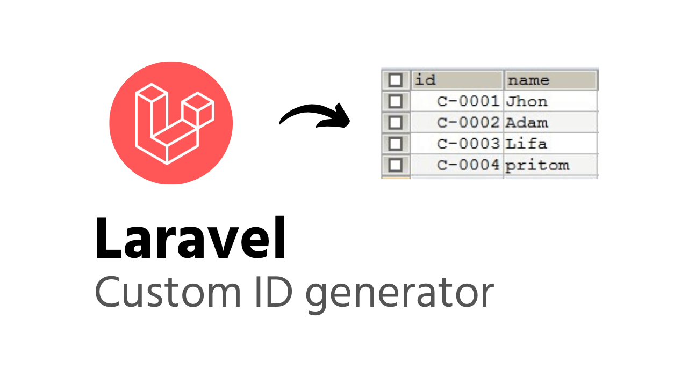

<h1 align="center">Laravel ID Generator</h1>

    
    
     
    
    

Easy way to generate custom ID from database table in Laravel framework

## Documentation
Get documentation on [laravelarticle.com](https://laravelarticle.com/laravel-custom-id-generator)
